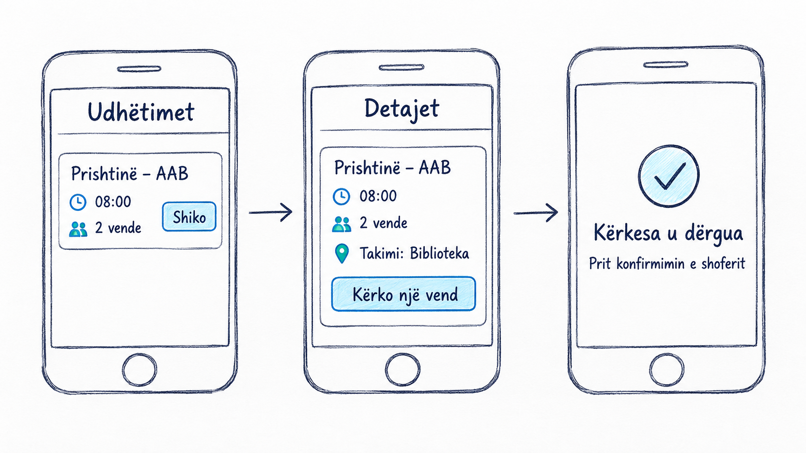

# Shembull i plotësuar: RideShare

**Shkurtesat:** MVP (Minimum Viable Product – produkti minimal i përdorshëm).

RideShare është projekti i ushtrimeve gjatë semestrit. Ky shembull të ndihmon të përgatitësh skicën dhe specifikimin me fjalët e tua.

## Problemi
Studenti ka nevojë të gjejë një udhëtim për AAB, sepse informacioni sot shpërndahet në shumë biseda. Arta dhe Dreni janë personazhe të sajuara të shembullit.

## Përdoruesit dhe qëllimi
Arta kërkon një vend. Dreni publikon udhëtimin dhe i përgjigjet kërkesës. Rrjedha përfundon kur Arta sheh nëse shoferi e ka pranuar.

## Skica e rrjedhës së udhëtares
1. **Udhëtimet:** sheh nisjen, destinacionin, orën dhe vendet e lira. Shtyp “Shiko”.
2. **Detajet:** sheh edhe vendin e takimit. Shtyp “Kërko një vend”.
3. **Statusi:** sheh “Në pritje të shoferit”. Më vonë statusi bëhet “Pranuar” ose “Refuzuar”.

## Veçoritë e MVP-së
- Shoferi publikon udhëtimin me vendet e lira.
- Udhëtari sheh listën dhe detajet dhe dërgon kërkesën.
- Shoferi përgjigjet; udhëtari sheh statusin.

## Për më vonë
Harta live, pagesa në aplikacion, chat, vlerësime dhe kupona.

## Rregullat dhe kriteret e pranimit
- Me një udhëtim të publikuar, lista shfaq nisjen, destinacionin, orën dhe vendet.
- Pas kërkesës, udhëtari sheh “Në pritje”. Një klikim i dytë nuk krijon kërkesë të dytë.
- Pas pranimit, numri i vendeve ulet me një dhe statusi ndryshon për të dy përdoruesit.
- Kur nuk ka vende, sistemi refuzon kërkesën dhe tregon arsyen.
- Nëse shoferi refuzon, vendet nuk ndryshojnë dhe udhëtari mund të zgjedhë udhëtim tjetër.
- Në MVP-në funksionale, të dhënat ruhen dhe mbeten pas rifreskimit. Dy persona duhet ta kryejnë rrjedhën nga pajisje të ndryshme. Serveri mbron vendin e fundit nga dy pranime njëkohësisht.

## Shembull i feedback-ut (ilustrues)
Një koleg mund ta lexojë “Rezervo” si konfirmim të menjëhershëm. E ndryshojmë në “Kërko një vend” dhe shtojmë “Në pritje të shoferit”. Ky është shembull i mundshëm i feedback-ut, jo provë reale e kryer.

## Prototipi në ligjëratë
[Hap demonstrimin](../../demo/rideshare/). Ai simulon veprimet vetëm në shfletues dhe nuk dërgon kërkesa te shoferë realë. Pamja me klikime ndihmon ta provojmë idenë; ruajtjen e përbashkët dhe identitetin i ndërtojmë me Next.js në javët pasuese.
